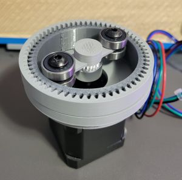
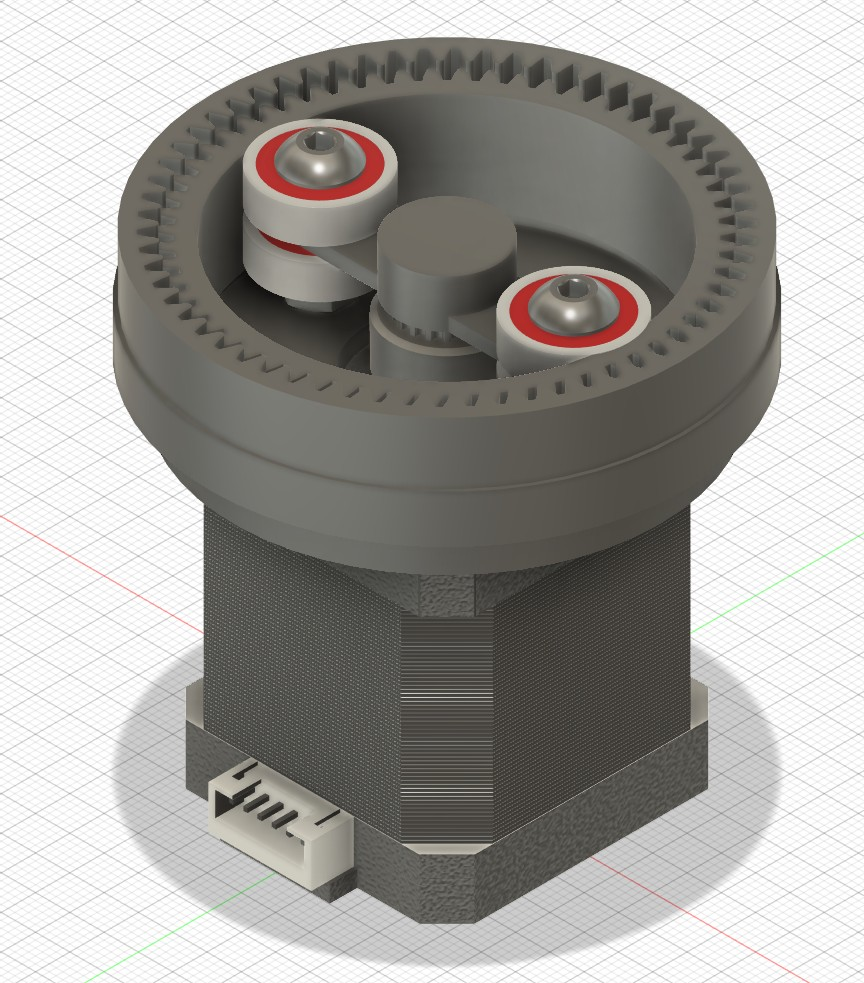
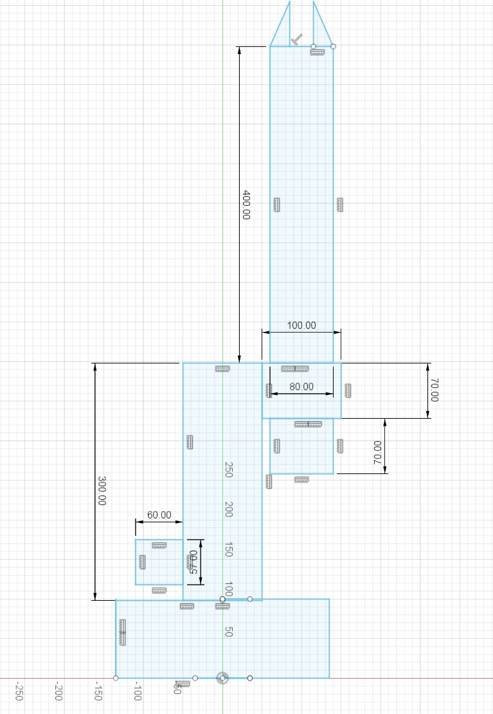
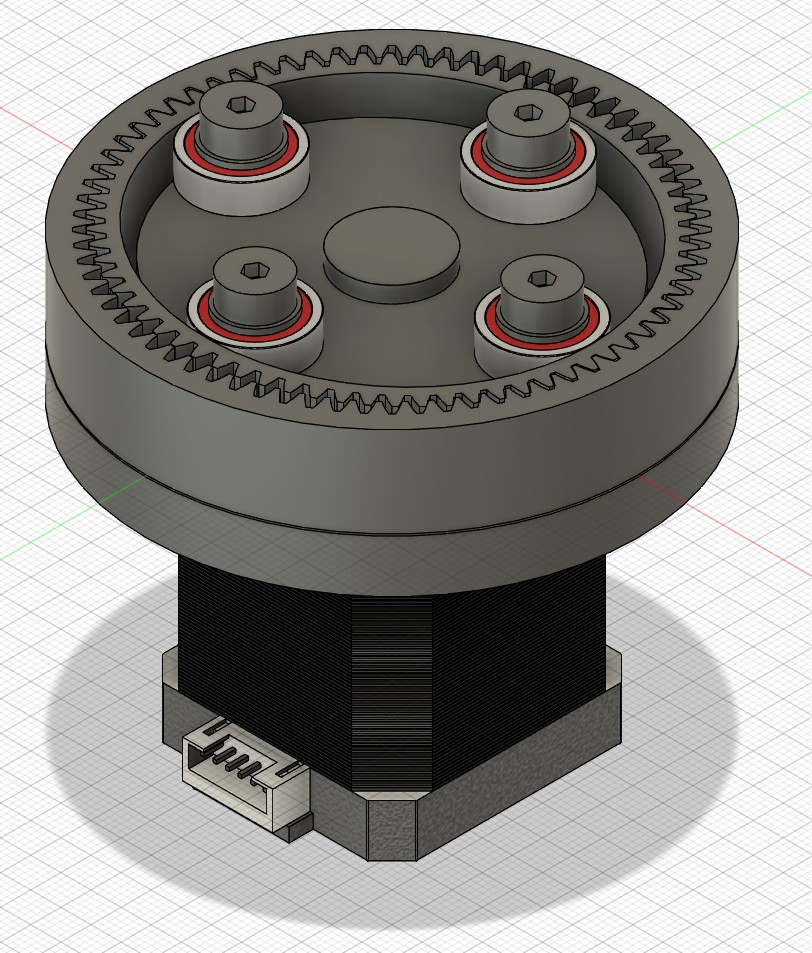

# Update Log

## March 9, 2025

-   Remodeled the entire gearbox (keeping the same design) after observing multiple issues in the previous versions.
    -   The stepper CAD model I was using in Fusion 360 was slightly different causing the bearings to be higher than intended.
    -   I didn't leave enough room in the circular spline for the flex spline in stretch enough to mesh with the output spline.
    -   Both of the above issues were causing the flex spline to slowly climb out of the circular spline.
-   Gears should mesh properly now (hopefully). I also adjusted the print overall to be more suited for 3D printing.
-   Ran out of time, not able to test yet.

## March 8, 2025

-   Did some more test fits keeping the same general design for the time being. It seems that the output spline's dimensions are not completely right at the moment.
-   After some research it seems that making the flex or output spline have slight thinner teeth (more gap between teeth) may fix the issue.
-   Currently working on a slightly new test design that will use 3mm bearings instead of 5mm bearings, as well as having a more stable output spline that doesn't try to pop out.

## March 6, 2025

-   First test fit complete. The circular spline and flex spline split was very good. The output spline diameter needs to be smaller. The wave generator should be lower to make proper contact and I'm considering using smaller bearings (3mm instead of 5mm) and having 3 on each side for more tooth contact.

-   Overall the drive is working correctly.

## March 5, 2025

-   Adjusted the 3D strain wave gearbox model, optimizing for cost, component capability, and FDM 3D printing.
-   Testing and adjustments of model are ongoing currently.

Updated initial design for 3D printing tolerance testing. I'm currently planning to make the final version closer to my original design as in theory, it should be more reliable.

## February 22, 2025

-   Worked on defining problem/project definition, general design, and required materials.
-   Looked at getting inspiration and ideas from existing solutions.
-   Started prototyping strain wave gearbox in Fusion 360 which will be used in multiple joints.

### General Structure

This is the general blueprint of the arm. The design decision are are the following:

Steppers motors will be used for their superior accuracy compared to servo motors, and cost compared to BLDC motors. The "yaw" of the arm will be performed by a Nema 17 motor in the base. The vertical rotation of joint 1 will be performed by a larger Nema 23 motor. Directly above the Nema 23, a Nema 17 with a belt will control the vertical rotation of joint 2. A Nema 17 will be mounted to joint 2 and via a belt control will control the horizontal rotation of joint 2. 2 Nema 17's will be mounted on the opposite side of joint 2 to the wrist joint. By mounting the motors here, their mass will be closer to the center, reducing undesied torque and acting as a counter weight. This should allow for a larger payload capacity. The wrist and actuator joints will be controlled by belts, the exact design has not been decided yet.

### First Gearbox Design

This design is not optimized for 3D printing and a new iteration of the gearbox suitable for 3D printing prototyping is nearly finished. The strain wave gearbox was chosen for it's quiet operation, minimal backlash, compact form factor, and high gear reduction.

## February 16, 2025 - Stage 2 Started
